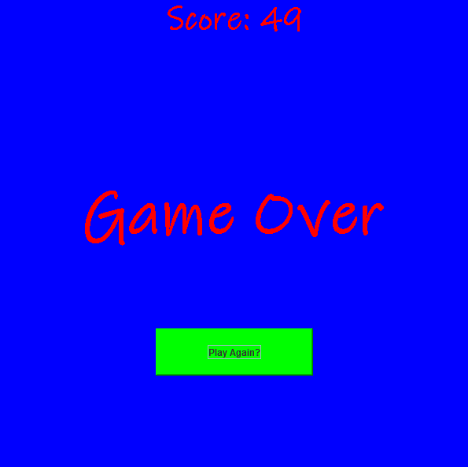

# AI-Snake_Project
## Members of Team:
  + Hoàng Hữu Hiếu (C) 
  + Hoàng Mạnh Hùng
  + Trần Bỉnh Hướng
  + Nguyễn Triệu Vương
  + Nguyễn Bá Kiên Lợn
## Ý tưởng: 
Dùng thuật toán tìm kiếm A* tạo game rắn tự động. Con rắn được bao quanh bởi 4 bức tường, mồi mới xuất hiện ngẫu nhiên 1 vị trí sau khi rắn ăn mồi cũ. Trò chơi kết thúc khi rắn đâm vào bức tường hoặc đâm vào thân/đuôi chính nó.

## Phương án triển khai công việc:
  + áp dụng thuật toán vào như thế nào 

## Background:
  + Giao diện bắt đầu
  

  + Giao diện vào game
  

  + Giao diện trò chơi kết thúc
  

## Kết Luận: 
 + Thành quả: - Tạo được thành công game rắn tự động
 + Ưu / nhược điểm:
  + ưu điểm: - Chế độ chơi thú vị và chân thật: Tạo trò chơi rắn ăn mồi tự động sử dụng thuật toán A* giúp tạo ra một trò chơi thú vị, có tính thử thách và giống như                  chơi với người thật.
             - Tăng khả năng tư duy của người chơi: Trò chơi này đòi hỏi người chơi có khả năng suy nghĩ logic, tính toán, đặc biệt là phát triển khả năng giải quyết                  vấn đề.
             - Tăng cường tính tương tác: Trò chơi cho phép người chơi tương tác với môi trường, tạo ra lối chơi tự do, góp phần giúp người chơi thoải mái thư giãn và                giải trí.
  + nhược điểm: - Tính tương đối khó điều chỉnh: Thuật toán A* thuộc loại đường đi ngắn nhất và không dễ dàng thay đổi được thuật toán và sửa đổi, điều này làm cho trò chơi rắn săn mồi tự động dùng thuật toán A* cũng khó được thay đổi. - Độ khó tăng nhanh: Trò chơi rắn săn mồi tự động dùng thuật toán A* có độ khó tăng lên rất nhanh, đặc biệt là ở những cấp độ sau, do đó tổng thời gian chơi của người chơi cũng sẽ ngắn hơn.
## Tài liệu tham khảo:
  + https://github.com/Yellowatch/Java-Snake-Game
  + https://github.com/NguyenTrieuVuong/SnakeGame
